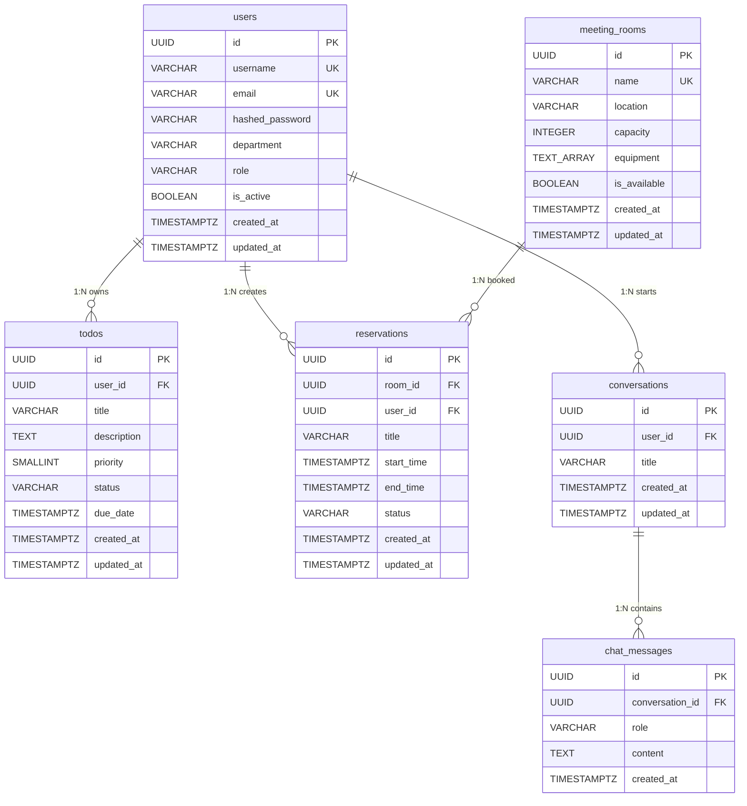
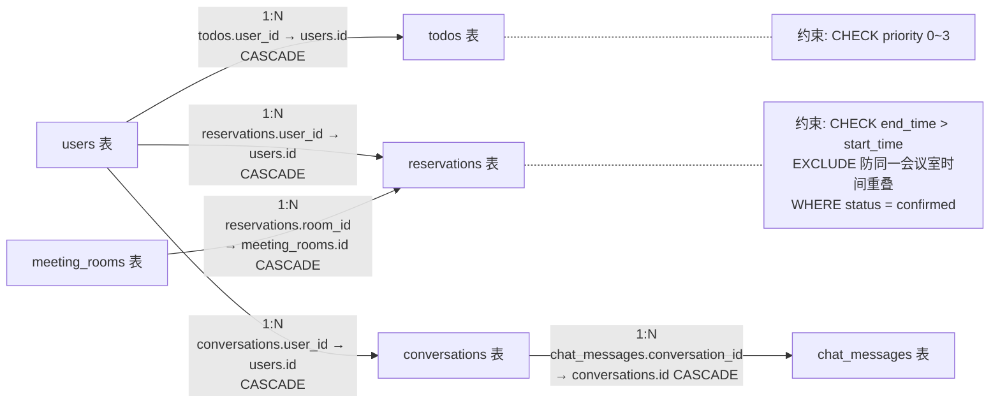
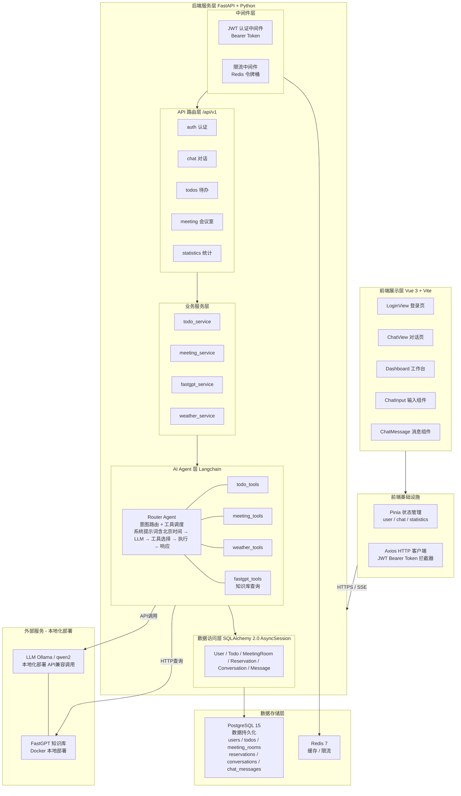
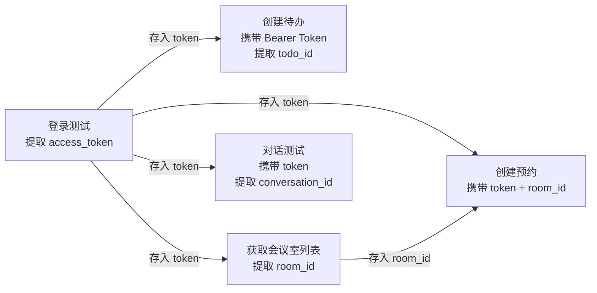

# AI 数字员工系统 — 第一迭代报告

---

## 1. 项目背景

随着企业数字化转型的深入推进，日常办公场景中对智能化工具的需求日益增长。传统的任务管理、会议室预约、信息查询等操作繁琐且效率低下，难以满足现代企业高效运作的需求。同时，数据安全和性能优化也是企业在引入智能助手时必须考虑的重要因素。

本项目旨在通过构建一套基于多智能体架构的企业数字员工系统，利用自然语言交互和智能化工具集成，帮助用户高效完成日常办公任务。系统将实现模型的本地化部署，确保数据安全和隐私保护。

---

## 2. 项目总体任务

```mermaid
flowchart TB
    system[AI数字员工系统]

    system --> auth[用户认证与安全]
    system --> assistant[智能助理与自然语言交互]
    system --> todo[待办事项管理]
    system --> meeting[会议室预约管理]
    system --> knowledge[知识库管理]
    system --> weather[天气与工具集成]

    auth --> auth_login[用户注册/登录]
    auth --> auth_jwt[JWT Token 签发与刷新]
    auth --> auth_pwd[密码加密存储]
    auth --> auth_limit[接口限流防护]

    assistant --> assistant_langchain[Langchain Router Agent]
    assistant --> assistant_route[意图识别与路由分发]
    assistant --> assistant_sse[SSE 流式输出]
    assistant --> assistant_context[多轮对话与上下文管理]
    assistant --> assistant_time[时间感知能力]

    todo --> todo_create[自然语言创建待办]
    todo --> todo_query[按状态/优先级筛选查询]
    todo --> todo_status[任务状态流转更新]
    todo --> todo_priority[四级优先级管理]
    todo --> todo_isolate[用户数据隔离]

    meeting --> meeting_room[会议室列表查询]
    meeting --> meeting_reserve[预约创建与冲突检测]
    meeting --> meeting_cancel[预约取消]
    meeting --> meeting_status[预约状态管理]

    knowledge --> knowledge_fastgpt[FastGPT 知识库对接]
    knowledge --> knowledge_qa[企业知识问答]
    knowledge --> knowledge_context[对话上下文保持]
    knowledge --> knowledge_fallback[服务降级处理]

    weather --> weather_realtime[实时天气查询]
    weather --> weather_forecast[未来天气趋势]
```

**图1：AI数字员工系统总体功能模块图**

**功能模块说明：**

- **智能助理与自然语言交互**：利用 Langchain 框架实现任务协调与上下文管理，自然语言交互响应时间需控制在秒级范围内。
- **待办事项管理**：实现待办事项的智能查询、分类和提醒功能，支持任务状态更新与通知推送。
- **会议室预约管理**：对接现有系统，支持通过自然语言问答快速完成会议室查询与预定，实现预约状态的实时更新通知。
- **知识库管理**：接入 FastGPT 可视化知识库管理工具，简化知识库管理与模型微调过程。
- **天气与其他工具集成**：提供实时天气信息查询及未来天气趋势预测。

---

## 3. 第一迭代需求分析 (Requirements)

### 3.1 迭代范围声明

> **第一迭代定位为 MVP（最小可行性产品）**，聚焦于核心链路的打通：用户可通过自然语言与 AI 助手交互，完成登录认证、待办事项管理、企业知识库问答等高频场景。多模块并行调度、复杂审批流、权限细粒度控制等高级功能不在本迭代范围内。

---

### 3.2 功能需求详细描述

#### 3.2.1 用户登录与认证

| 需求项 | 描述 |
|--------|------|
| **用户注册** | 用户通过用户名、邮箱和密码注册账户，系统对用户名和邮箱进行唯一性校验，密码使用 bcrypt 算法加密存储，注册接口设有频率限制（防止暴力注册） |
| **用户登录** | 支持用户名或邮箱 + 密码方式登录，验证成功后签发 JWT Token（HS256 签名，默认有效期 24 小时），后续请求通过 Bearer Token 鉴权 |
| **身份维持** | 提供 Token 刷新机制（`/auth/refresh`），支持修改密码功能（`/auth/change-password`），当前用户信息获取（`/auth/me`） |
| **安全防护** | 密码 bcrypt 加密存储（自动加盐）、JWT 令牌过期校验、登录频率限制、账户禁用检测 |

#### 3.2.2 智能对话交互

| 需求项 | 描述 |
|--------|------|
| **自然语言对话** | 用户在前端输入自然语言消息，后端通过 Langchain Router Agent 理解用户意图，自动路由到相应工具执行任务并返回结果 |
| **流式输出** | 支持 SSE（Server-Sent Events）流式响应，前端可逐字/逐句显示 AI 回复，提升交互体验，自然语言交互响应时间控制在秒级 |
| **多轮对话** | 支持会话管理（创建、列表、删除），同一会话内自动维护上下文历史，Agent 可理解上下文中的指代和省略 |
| **意图识别** | Agent 自动识别用户意图并调用对应工具：待办事项管理、会议室查询、天气查询、知识库问答。一次仅执行一个相关操作，避免误操作 |
| **时间感知** | 系统提示词注入当前北京时间，Agent 可理解"明天""下周三"等相对时间表达 |

#### 3.2.3 待办事项管理

| 需求项 | 描述 |
|--------|------|
| **自然语言创建** | 用户通过对话创建待办事项，如"帮我记一下明天下午3点开会"，Agent 自动提取标题、截止日期等信息并调用创建工具 |
| **列表查询** | 支持按状态筛选（待处理 / 进行中 / 已完成 / 已取消），分页返回结果，按优先级和创建时间排序 |
| **状态更新** | 支持将待办事项标记为进行中、已完成等状态，可通过自然语言触发，如"把XX任务标记为完成" |
| **优先级管理** | 支持四级优先级（低/中/高/紧急），通过 CHECK 约束保证数据一致性 |
| **数据隔离** | 每个用户只能查看和操作自己的待办事项，通过 user_id 外键和认证中间件实现数据隔离 |

#### 3.2.4 知识库对接

| 需求项 | 描述 |
|--------|------|
| **企业知识问答** | 用户提问关于公司规章制度、流程、政策等问题，Agent 调用 FastGPT 知识库工具获取答案并返回 |
| **FastGPT 集成** | 通过 HTTP API 调用 FastGPT 服务，支持异步请求、超时控制（30s）和自动重试（最多3次），兼容 OpenAI 格式响应解析 |
| **对话上下文** | FastGPT 调用支持 chatId 参数，可在同一会话内保持知识库的对话上下文 |
| **降级处理** | 当 FastGPT 服务不可用时，Agent 向用户说明原因并提供替代建议 |

### 3.3 性能指标

| 指标 | 要求 |
|------|------|
| 自然语言交互响应时间 | 控制在秒级（< 5s），流式输出首 token 到达时间 < 2s |
| API 接口响应时间 | 非 LLM 依赖接口 < 200ms |
| 并发支持 | 单用户限流 10 req/s，全局 500 req/s |

### 3.4 本迭代明确不包含的功能

- 多 Agent 并行调度与协作
- 复杂审批流与工作流引擎
- 角色权限细粒度控制（RBAC 完整实现）
- 数据可视化大屏（Echarts）
- 会议室预约的日历视图
- 消息推送与通知系统
- 移动端适配

---

## 4. 第一迭代系统设计 (System Design)

### 4.1 核心接口表

#### 4.1.1 认证模块 API

| 方法 | 路径 | 功能 | 认证 |
|------|------|------|------|
| POST | `/api/v1/auth/register` | 用户注册 | 否 |
| POST | `/api/v1/auth/login` | 用户登录，返回 JWT Token | 否 |
| GET | `/api/v1/auth/me` | 获取当前用户信息 | 是 |
| POST | `/api/v1/auth/refresh` | 刷新 Token | 是 |
| POST | `/api/v1/auth/change-password` | 修改密码 | 是 |

#### 4.1.2 对话模块 API

| 方法 | 路径 | 功能 | 认证 |
|------|------|------|------|
| POST | `/api/v1/chat/` | 发送对话消息（同步响应） | 是 |
| POST | `/api/v1/chat/stream` | 流式对话（SSE） | 是 |
| POST | `/api/v1/chat/quick` | 快捷对话 | 是 |
| GET | `/api/v1/chat/conversations` | 获取会话列表 | 是 |
| POST | `/api/v1/chat/conversations` | 创建新会话 | 是 |
| GET | `/api/v1/chat/conversations/{id}/messages` | 获取会话消息历史 | 是 |
| DELETE | `/api/v1/chat/conversations/{id}` | 删除会话 | 是 |

#### 4.1.3 待办事项模块 API

| 方法 | 路径 | 功能 | 认证 |
|------|------|------|------|
| GET | `/api/v1/todos/` | 获取待办列表（支持筛选/分页） | 是 |
| POST | `/api/v1/todos/` | 创建待办事项 | 是 |
| GET | `/api/v1/todos/{id}` | 获取单个待办详情 | 是 |
| PUT | `/api/v1/todos/{id}` | 更新待办事项 | 是 |
| PATCH | `/api/v1/todos/{id}/status` | 更新待办状态 | 是 |
| DELETE | `/api/v1/todos/{id}` | 删除待办事项 | 是 |

#### 4.1.4 会议室模块 API

| 方法 | 路径 | 功能 | 认证 |
|------|------|------|------|
| GET | `/api/v1/meetings/rooms` | 获取会议室列表 | 是 |
| GET | `/api/v1/meetings/rooms/{id}` | 获取会议室详情 | 是 |
| POST | `/api/v1/meetings/reservations` | 创建预约（含冲突检测） | 是 |
| GET | `/api/v1/meetings/reservations` | 获取我的预约列表 | 是 |
| GET | `/api/v1/meetings/reservations/{id}` | 获取预约详情 | 是 |
| DELETE | `/api/v1/meetings/reservations/{id}` | 取消预约 | 是 |

#### 4.1.5 统计模块 API

| 方法 | 路径 | 功能 | 认证 |
|------|------|------|------|
| GET | `/api/v1/statistics/todo-stats` | 待办事项统计 | 是 |
| GET | `/api/v1/statistics/meeting-stats` | 会议室使用统计 | 是 |
| GET | `/api/v1/statistics/overview` | 数据概览 | 是 |

---

### 4.2 数据库 E-R 图

### 4.3 数据库关系图

### 4.4 系统分层架构图

### 4.5 安全设计要点

| 安全维度 | 实现方案 |
|----------|----------|
| **密码安全** | 使用 bcrypt 算法加密存储密码，自动加盐，防止彩虹表攻击 |
| **传输安全** | 生产环境通过 Nginx 配置 SSL/TLS 证书，强制 HTTPS 传输，防止中间人攻击 |
| **认证安全** | JWT Token（HS256 签名）+ Bearer 方案，Token 有效期 24h，支持刷新和吊销 |
| **接口防护** | Redis 令牌桶限流（单用户 10 req/s，全局 500 req/s），防止接口滥用 |
| **数据隔离** | 所有数据操作强制绑定 user_id，通过认证中间件注入，确保用户只能访问自己的数据 |
| **模型本地化** | LLM 采用 Ollama 本地部署（qwen2 模型），FastGPT 知识库同样本地化部署，企业数据不出内网，保障数据安全 |
| **数据库安全** | PostgreSQL 最小权限用户、参数化查询防 SQL 注入、EXCLUDE 约束防业务数据冲突 |

---

## 5. 第一迭代系统测试 (Testing)

### 5.1 后端接口测试

**测试方式**：Postman 接口自动化测试 

**测试工具**：
- **Postman**：使用 Postman Collection 编写接口测试集合，通过脚本实现变量链式传递（登录获取 Token → 自动填充后续请求），一键运行全量接口验证
- **Swagger UI**：FastAPI 自动生成文档（访问 `http://localhost:8000/docs`），用于接口浏览和手动调试

#### 5.1.0 Postman 测试集合结构

> 测试集合名称：`AI数字员工系统-第一迭代测试`
> 基础地址：`http://localhost:8000`

| 分组 | 测试项数 | 说明 |
|------|----------|------|
| 0-基础检查 | 1 | 健康检查（GET /health） |
| 1-认证模块 | 1 | 登录获取 Token，自动存入集合变量 |
| 2-待办模块 | 1 | 创建待办，自动存入 todo_id |
| 3-会议室模块 | 1 | 获取会议室列表（自动存入 room_id） |
| 4-AI模块 | 1 | 对话功能测试，自动存入 conversation_id |

**变量链式传递机制**：

**集合变量定义**：

| 变量名 | 初始值 | 说明 |
|--------|--------|------|
| base_url | http://localhost:8000 | 后端服务地址 |
| token | 空 | 登录后自动填充 |
| todo_id | 空 | 创建待办后自动填充 |
| room_id | 空 | 获取会议室列表后自动填充 |
| reservation_id | 空 | 创建预约后自动填充 |
| conversation_id | 空 | 对话测试后自动填充 |
| tomorrow_10 | 自动设置为第二天10点  | 预约开始时间 |
| tomorrow_11 | 自动设置为第二天11点 | 预约结束时间 |

#### 5.1.1 认证接口测试

| 接口 | 测试用例 | 预期结果 | 断言脚本 |
|------|----------|----------|----------|
| POST `/api/v1/auth/register` | 注册新用户 test_user（用户名/邮箱/密码/部门） | 201 Created 返回用户信息，或 400 用户已存在 | 校验状态码 + 返回 username 字段 |
| POST `/api/v1/auth/login` | 使用 test/123456 登录 | 200 OK，返回 JWT Token + 用户信息 | 校验 status=200 + access_token 为字符串 + 自动存入 `token` 变量 |
| GET `/api/v1/auth/me` | 携带 Bearer Token 获取用户信息 | 200 OK，返回当前用户详情 | 校验 status=200 + username 为 "test" |

#### 5.1.2 对话接口测试

| 接口 | 测试用例 | 预期结果 | 断言脚本 |
|------|----------|----------|----------|
| POST `/api/v1/chat/` | 发送 `{"message": "你好"}` | 200 OK，返回 AI 回复 + conversation_id | 校验 status=200 + message 为字符串 + 自动存入 `conversation_id` |
| POST `/api/v1/chat/` | 发送 `{"message": "我有哪些待办事项", "conversation_id": "{{conversation_id}}"}` | 200 OK，同一会话上下文连续 | 校验 conversation_id 与前次一致 |
| POST `/api/v1/chat/stream` | 发送"帮我创建一个待办：明天下午3点开会" | SSE 流式返回，AI 理解意图并调用 create_todo 工具 | Swagger/Postman 流式响应截图 |
| POST `/api/v1/chat/stream` | 发送"公司的报销流程是什么" | Agent 调用 FastGPT 知识库返回答案 | 知识库问答成功截图 |

#### 5.1.3 待办事项接口测试

| 接口 | 测试用例 | 预期结果 | 断言脚本 |
|------|----------|----------|----------|
| POST `/api/v1/todos/` | 创建待办（title/priority=2） | 201 Created，返回含 UUID 的待办详情 | 校验 status=201 + id 为字符串 + 自动存入 `todo_id` |
| GET `/api/v1/todos/` | 获取待办列表（page=1, page_size=10） | 200 OK，返回分页列表 | 校验 status=200 + items 为数组 + total 为数字 |
| PATCH `/api/v1/todos/{id}/status` | 更新状态为 completed | 200 OK，状态已变更 | 校验 status=200 + status 字段为 "completed" |

#### 5.1.4 会议室接口测试

| 接口 | 测试用例 | 预期结果 | 断言脚本 |
|------|----------|----------|----------|
| GET `/api/v1/meetings/rooms` | 查询可用会议室 | 200 OK，返回会议室列表（含设备信息） | 校验 status=200 + items 为数组 + 自动存入第一项 `room_id` |
| POST `/api/v1/meetings/reservations` | 创建预约（room_id + 时间段） | 201 Created，返回预约详情 | 校验 status=201 + id 为字符串 + 自动存入 `reservation_id` |
| GET `/api/v1/meetings/reservations` | 获取我的预约列表 | 200 OK，返回预约列表 | 校验 status=200 + items 为数组 |
| DELETE `/api/v1/meetings/reservations/{id}` | 取消预约 | 204 No Content | 校验状态码为 204 或 200 |

#### 5.1.5 统计接口测试

| 接口 | 测试用例 | 预期结果 | 断言脚本 |
|------|----------|----------|----------|
| GET `/api/v1/statistics/todo-stats` | 获取待办事项统计 | 200 OK，返回按状态分组的统计数据 | 校验 status=200 + status 字段为 "success" |
| GET `/api/v1/statistics/meeting-stats` | 获取会议室使用统计 | 200 OK，返回使用率统计 | 校验 status=200 + status 字段为 "success" |
| GET `/api/v1/statistics/overview` | 获取数据概览 | 200 OK，返回待办+会议综合统计 | 校验含 todo_stats 和 meeting_stats 字段 |

### 5.2 前端界面测试

#### 5.2.1 登录功能测试

| 测试场景 | 操作步骤 | 预期效果 | 截图要求 |
|----------|----------|----------|----------|
| 正常登录 | 输入用户名密码 → 点击登录 | 跳转至聊天主页，顶栏显示用户名 | 登录页 + 聊天主页截图 |
| 登录失败 | 输入错误密码 | 提示"用户名或密码错误" | 错误提示截图 |

#### 5.2.2 智能对话测试（重点）

| 测试场景 | 操作步骤 | 预期效果 | 截图要求 |
|----------|----------|----------|----------|
| 待办创建 | 输入"帮我记一下明天要交周报" | AI 流式输出，自动创建待办事项 | **前端界面流式输出截图** |
| 待办查询 | 输入"我有哪些待办" | AI 列出当前用户的待办事项 | 待办列表展示截图 |
| 知识库问答 | 输入"公司年假政策是什么" | AI 调用知识库返回答案 | **大模型正确回答问题截图** |
| 天气查询 | 输入"上海今天天气怎么样" | AI 返回天气信息 | 天气查询截图 |

#### 5.2.3 数据闭环验证（待办事项）

> **关键测试：前端操作 → 数据库验证，形成完整逻辑闭环**

| 步骤 | 操作 | 验证方式 | 截图要求 |
|------|------|----------|----------|
| 1 | 通过对话让 AI 创建待办事项"提交项目报告" | 前端界面显示 AI 创建成功的回复 | **前端界面成功录入截图** |
| 2 | 在 PostgreSQL 中查询 todos 表 | 数据库中存在对应记录，title="提交项目报告" | **PostgreSQL 数据库对应数据插入成功的截图** |
| 3 | 对比前端显示的待办 ID 与数据库记录 ID | 两者一致，证明数据链路完整 | 两张截图对比标注 |

### 5.3 测试截图清单

> 以下截图需要在系统运行时自行截取，本处列出需截图的具体场景：

| 序号 | 截图场景 | 用途 | 备注 |
|------|----------|------|------|
| 1 | Postman 测试集合运行结果（Runner 全量通过） | 证明后端 API 接口自动化测试通过 | 含集合名称和通过/总数 |
| 2 | Swagger UI 接口列表页 | 证明后端 API 已部署可访问 | 含浏览器地址栏 |
| 3 | 登录接口成功响应（含 Token） | 证明认证链路通畅 | |
| 4 | 前端登录页面 | 证明前端可正常访问 | 含本地开发环境特征 |
| 5 | 前端对话界面 — AI 流式输出 | 证明大模型对话功能正常 | **核心截图** |
| 6 | 前端对话界面 — AI 回答知识库问题 | 证明知识库对接正常 | **核心截图** |
| 7 | 前端对话界面 — AI 创建待办成功 | 证明待办事项通过自然语言创建 | |
| 8 | PostgreSQL — todos 表新增记录 | 证明数据成功写入数据库 | 与截图7形成闭环 |
| 9 | Swagger — 待办事项列表查询结果 | 证明 CRUD 接口完整可用 | |
| 10 | 前端仪表盘页面 | 证明统计功能正常 | |

---

## 6. 第一迭代项目管理 (Project Management)

### 6.1 任务分配表

| 角色 | 姓名 | 职责 | 具体工作内容 |
|------|------|------|-------------|
| 后端开发 | 张胜伟 | 全栈后端 | FastAPI 项目搭建、数据库建模（init.sql）、认证中间件（JWT/bcrypt）、RESTful API（auth/todos/meetings/chat/statistics）、Langchain Router Agent 开发、工具系统（todo_tools/meeting_tools/weather_tools/fastgpt_tools）、业务服务层、Docker 容器化部署 |
| 前端开发 | 刘卓文 | 前端工程 | Vue 3 + Vite 项目搭建、路由系统（登录/对话/仪表盘）、Pinia 状态管理（user/chat/statistics）、组件开发（ChatInput/ChatMessage/MeetingChart/TaskChart）、Axios 封装与 JWT 拦截器、SSE 流式接收、UI 样式与交互 |
| 文档与测试 | 张胤嘉 | 质量保障 | Swagger 接口文档验证、Postman 接口测试、前端功能测试、E-R 图与架构图绘制、迭代报告撰写 |

### 6.2 已完成任务证明

#### 6.2.1 开发环境运行截图

| 截图场景 | 说明 | 截图要求 |
|----------|------|----------|
| FastAPI 启动日志 | 终端显示 Uvicorn 启动成功、路由注册信息 | 含终端窗口、启动端口信息 |
| Docker Compose 服务状态 | `docker-compose ps` 输出，所有服务 healthy | 含容器名称和状态 |
| Langchain Agent 启动日志 | 终端显示 Agent 工具注册、LLM 连接成功 | 含工具列表和模型名称 |
| 依赖安装成功 | `pip install -r requirements.txt` 完成 | 含安装成功信息 |

#### 6.2.2 代码结构截图

| 截图场景 | 说明 | 截图要求 |
|----------|------|----------|
| 后端项目目录 | 展示 backend/app 下完整目录结构 | 含 agents/api/middleware/models/schemas/services/tools |
| 前端项目目录 | 展示 frontend/src 下完整目录结构 | 含 api/components/router/stores/views |
| GitHub 仓库主页 | 展示项目仓库主页 | 含 README、文件列表 |

### 6.3 下一迭代计划

| 优先级 | 功能模块 | 具体内容 | 预期目标 |
|--------|----------|----------|----------|
| P0 | **会议室系统深度对接** | 完善会议室预约的自然语言交互流程，支持通过对话完成会议室筛选、时段选择、预约创建的完整链路 | 用户可通过自然语言完成从"找个会议室"到"预约成功"的全流程 |
| P0 | **数据可视化大屏（Echarts）** | 开发 Dashboard 页面的 Echarts 可视化组件：待办事项状态饼图（TaskChart）、会议室使用率柱状图/折线图（MeetingChart） | 替换当前静态数据，对接统计 API 实时展示 |
| P1 | **对话体验优化** | 接入 LLM 原生流式输出（token-level streaming），替代当前按句子分块的模拟流式 | 首 token 到达时间 < 1s，打字机效果更自然 |
| P1 | **多轮对话增强** | 优化 Agent 上下文窗口管理，支持长会话的上下文摘要与截断策略 | 支持 50+ 轮对话不丢失关键上下文 |
| P2 | **权限体系完善** | 实现 RBAC 完整模型（admin/manager/user），管理后台界面 | 不同角色看到不同数据和功能 |
| P2 | **消息通知** | 待办到期提醒、预约变更通知 | WebSocket 实时推送 |
| P3 | **移动端适配** | 响应式布局，支持手机浏览器访问 | 主要功能在移动端可用 |

---

## 附录

### A. 技术栈汇总

| 层级 | 技术 |
|------|------|
| 前端框架 | Vue 3 + Vite |
| 状态管理 | Pinia |
| HTTP 客户端 | Axios |
| 后端框架 | FastAPI |
| ORM | SQLAlchemy 2.0 (Async) |
| AI 框架 | Langchain |
| 知识库 | FastGPT |
| 数据库 | PostgreSQL |
| 缓存 | Redis |
| 容器化 | Docker + Docker Compose |
| Web 服务器 | Nginx |

### B. 数据库表一览

| 表名 | 记录数（测试） | 说明 |
|------|---------------|------|
| users | 2 | 测试用户 test + 管理员 admin |
| todos | - | 用户待办事项 |
| meeting_rooms | 3 | A栋301/A栋302/B栋201 |
| reservations | - | 会议室预约记录 |
| conversations | - | 聊天会话 |
| chat_messages | - | 聊天消息记录 |

### C. 测试账号

| 角色 | 用户名 | 密码 | 部门 |
|------|--------|------|------|
| 普通用户 | test | 123456 | 技术部 |
| 管理员 | admin | 123456 | 管理部 |
