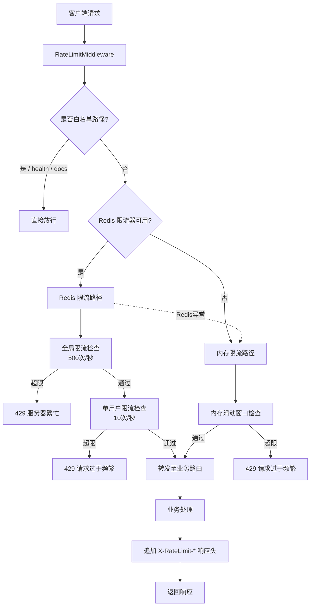
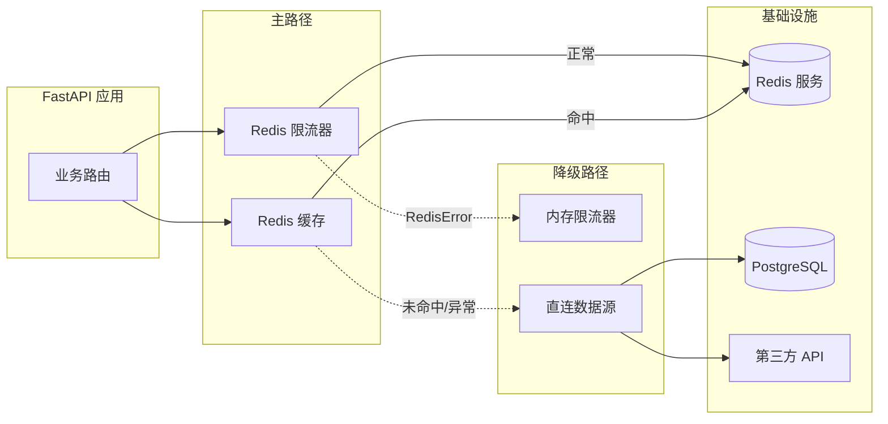
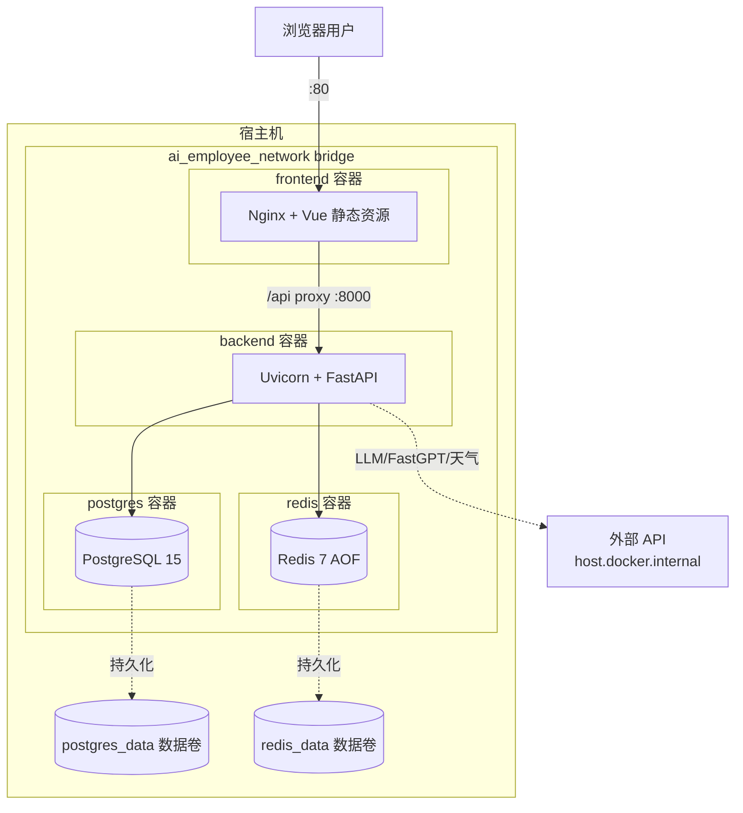
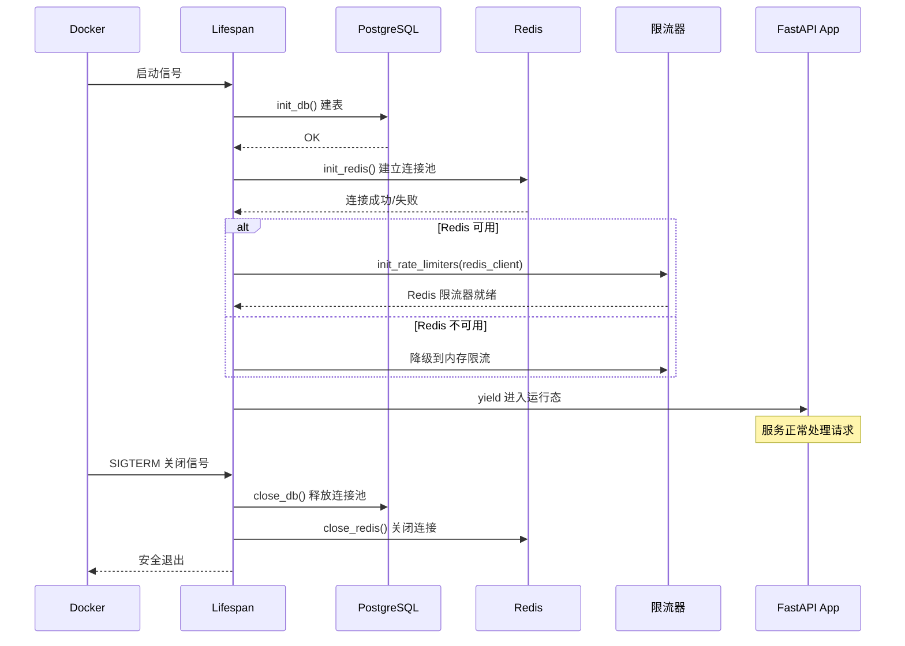
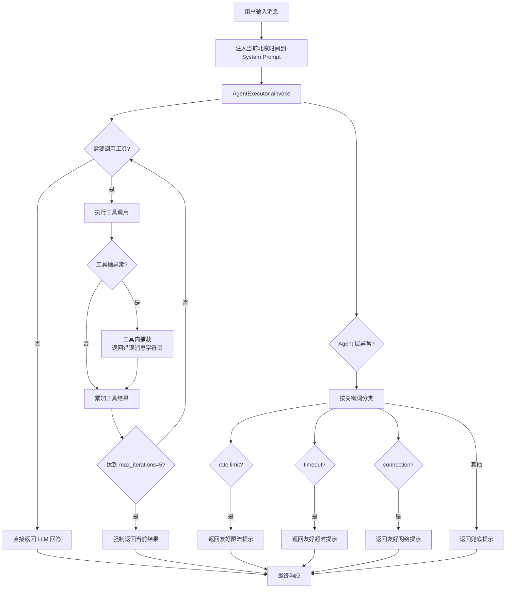

# AI 数字员工系统 — 第三迭代报告

---

## 1. 迭代概述

| 项目 | 内容 |
|------|------|
| **迭代周期** | 第三迭代 |
| **迭代目标** | 在第二迭代功能完备的基础上，聚焦**系统健壮性与工程化运维**，建设分布式限流体系、全链路降级保护、Docker 全栈化部署、健康检查与异常兜底机制，同时修复 SQLAlchemy 异步懒加载（MissingGreenlet）等生产级缺陷，将系统从"好用"推进到"稳定可运维" |
| **与上一迭代关系** | 承接第二迭代的功能成果（数据看板、会议室全流程、Redis 缓存），不新增业务功能，转而深化底层能力，为后续多用户并发与生产部署奠定基础 |

### 1.1 迭代工作全景图

```mermaid
flowchart TB
    system[AI数字员工系统第三迭代]

    system --> reliability[系统健壮性]
    system --> devops[工程化运维]
    system --> bugfix[生产级缺陷修复]
    system --> agent_robust[Agent 稳定性增强]

    reliability --> ratelimit[Redis 分布式限流]
    reliability --> fallback[三层降级保护]
    reliability --> exception[全局异常处理]
    reliability --> dbpool[数据库连接池调优]

    ratelimit --> sliding[滑动窗口算法]
    ratelimit --> user_limit[单用户 10次/秒]
    ratelimit --> global_limit[全局 500次/秒]

    fallback --> redis_layer[Redis 限流器]
    fallback --> memory_layer[内存限流器 Fallback]
    fallback --> cache_degrade[缓存静默降级]

    devops --> docker[Docker 全栈编排]
    devops --> healthcheck[四层健康检查]
    devops --> lifecycle[Lifespan 生命周期]
    devops --> logs[启动/关闭日志标准化]

    docker --> pg_container[PostgreSQL 容器]
    docker --> redis_container[Redis 容器]
    docker --> backend_container[后端容器]
    docker --> frontend_container[前端 Nginx 容器]

    bugfix --> missing_greenlet[MissingGreenlet 修复]
    bugfix --> expunge_pattern[expunge + selectinload 模式]
    bugfix --> time_aware[Agent 时间感知修复]

    agent_robust --> err_class[错误分类兜底]
    agent_robust --> max_iter[max_iterations 保护]
    agent_robust --> tz_inject[北京时区动态注入]
```

**图1：第三迭代工作全景图（四大主线：健壮性 / 运维 / 修复 / Agent 稳定性）**

---

## 2. 第三迭代需求分析 (Requirements)

### 2.1 迭代范围声明

> **第三迭代聚焦"系统稳定性与工程化能力"**：不新增业务功能，而是围绕分布式限流、降级保护、容器化部署、健康监测、异常兜底与生产级缺陷修复展开，使系统具备可持续运维和多用户并发承载能力。LLM 原生流式、RBAC 权限体系、消息推送等业务增强不在本迭代范围内。

---

### 2.2 健壮性需求详细描述

#### 2.2.1 分布式限流体系

| 需求项 | 描述 |
|--------|------|
| **滑动窗口算法** | 采用 Redis Sorted Set 实现精确滑动窗口：Score 存时间戳，通过 `ZREMRANGEBYSCORE` 清理过期记录，`ZCARD` 统计窗口内请求数，避免固定窗口边界突刺 |
| **单用户限流** | 基于客户端 IP 维度限流，默认 10 次/秒，防止单用户恶意刷接口或前端 Bug 造成资源浪费 |
| **全局限流** | 针对整个服务维度限流，默认 500 次/秒，保护 LLM 调用成本和数据库连接池 |
| **Pipeline 原子操作** | 所有限流检查通过 Redis Pipeline 批量下发（zremrangebyscore + zcard + zadd + expire），保证原子性 |
| **透传响应头** | 通过 `X-RateLimit-Remaining`、`X-RateLimit-Limit`、`Retry-After` 向客户端暴露剩余配额与退避时间 |
| **白名单路径** | `/`、`/health`、`/docs`、`/openapi.json`、`/redoc` 不受限流约束，确保健康检查与文档始终可达 |

#### 2.2.2 三层降级保护

| 需求项 | 描述 |
|--------|------|
| **Redis 限流器（主）** | 应用启动时尝试初始化 Redis 限流器，成功则优先使用；支持分布式部署，多实例共用限流窗口 |
| **内存限流器（备）** | Redis 不可用或抛出 `RedisError` 时自动降级到进程内 `MemoryRateLimiter`，基于 `defaultdict + threading.Lock` 实现 |
| **缓存静默降级** | `cache_service` 的天气、会议室、会话缓存在 Redis 异常时仅记录警告日志，直接回源数据库/第三方 API，业务无感 |
| **异常转运** | `is_redis_limiter_available()` 通过全局变量快速判断 Redis 可用性，避免每次请求都尝试连接 |

#### 2.2.3 全局异常处理

| 需求项 | 描述 |
|--------|------|
| **HTTPException 统一响应** | 所有主动抛出的业务异常经 `http_exception_handler` 包装为 `{status, code, message, path}` 格式 |
| **请求体校验异常** | `RequestValidationError` 被 `validation_exception_handler` 解析为字段级错误列表（field/message/type），便于前端定位 |
| **未捕获异常兜底** | `general_exception_handler` 拦截所有未处理异常，统一返回 500，不向客户端暴露堆栈信息 |
| **AI Agent 错误分类** | Agent 调用链内按错误关键字分类（rate limit / timeout / connection），分别返回对用户友好的中文提示 |

#### 2.2.4 数据库与异步修复

| 需求项 | 描述 |
|--------|------|
| **连接池调优** | `pool_size=20`、`max_overflow=30`、`pool_recycle=3600`、`pool_pre_ping=True`，配合 PostgreSQL `max_connections=100` 预留安全水位 |
| **MissingGreenlet 修复** | 修复会议室创建预约接口的 `greenlet_spawn has not been called outside of an async context` 错误 |
| **expunge + re-query 模式** | 创建预约后先 `db.expunge(reservation)` 从 identity map 移除，再通过 `selectinload(Reservation.room, Reservation.user)` 重查，彻底规避延迟加载陷阱 |
| **selectinload 全面覆盖** | `get_user_reservations`、`get_reservation_by_id` 同步补充 room 和 user 的预加载，Pydantic 序列化零懒加载触发 |

---

### 2.3 工程化运维需求

#### 2.3.1 Docker 全栈化部署

| 需求项 | 描述 |
|--------|------|
| **四容器编排** | `docker-compose.yml` 编排 PostgreSQL 15 / Redis 7 / FastAPI 后端 / Nginx 前端四个服务，统一 bridge 网络互通 |
| **健康检查联动** | 后端 `depends_on` 配置 `condition: service_healthy`，等待 Postgres 和 Redis 健康后再启动，避免竞态 |
| **环境变量注入** | `.env` 统一管理 JWT 密钥、LLM 地址、FastGPT Key、天气 Key、限流阈值，Docker Compose 通过 `${VAR:-default}` 支持默认值 |
| **数据卷持久化** | `postgres_data`、`redis_data` 命名数据卷持久化数据，容器重启不丢数据 |
| **初始化 SQL 注入** | 启动时自动执行 `backend/migrations/init.sql` 建表与种子数据 |
| **Redis 生产配置** | `--appendonly yes --maxmemory 256mb --maxmemory-policy allkeys-lru`，限制内存占用并启用 AOF 持久化 |
| **时区统一** | Postgres 容器 `TZ: Asia/Shanghai`，与后端代码 `beijing_tz` 保持一致 |

#### 2.3.2 应用生命周期与健康检查

| 需求项 | 描述 |
|--------|------|
| **Lifespan 统一管理** | 使用 FastAPI `@asynccontextmanager` 在 startup 阶段顺序初始化数据库 → Redis 缓存 → Redis 限流器，shutdown 阶段逆序释放 |
| **根路径检查 `/`** | 轻量检查，仅返回服务名与版本，用于负载均衡器存活探针 |
| **深度检查 `/health`** | 返回 `{status, database, cache}`，暴露各依赖连接状态，用于监控系统与 Docker healthcheck |
| **容器级健康检查** | 四个容器全部配置 `healthcheck` 块，失败自动重启（`restart: unless-stopped`） |

#### 2.3.3 Agent 稳定性增强

| 需求项 | 描述 |
|--------|------|
| **错误分类兜底** | Agent 执行过程中捕获异常后按关键词分类：`rate limit`→429 友好提示、`timeout`→超时提示、`connection`→网络提示、其他→兜底文案 |
| **迭代次数上限** | `create_openai_tools_agent` 配置 `max_iterations=5`，防止工具调用死循环耗尽 LLM 配额 |
| **动态时间注入** | 每次 Agent 调用时通过 `datetime.now(beijing_tz)` 重新计算北京时间，动态写入系统提示词，避免"明天""下周"等相对时间语义错乱 |
| **工具分离设计** | 四类工具（todo / meeting / weather / fastgpt）独立模块注册，单个工具异常不影响其他工具可用性 |

### 2.4 本迭代明确不包含的功能

- LLM 原生 token-level streaming 输出
- RBAC 完整权限体系（admin/manager/user 角色细分）
- WebSocket 消息推送与到期提醒
- 移动端深度适配与 PWA 支持
- Agent 多步骤任务编排与子目标分解
- Prometheus / Grafana 监控指标导出

---

## 3. 第三迭代系统设计 (System Design)

### 3.1 本迭代新增接口表

> 本迭代以健壮性建设为主，仅新增健康检查类接口，业务接口维持第二迭代状态不变。

| 方法 | 路径 | 功能 | 认证 | 说明 |
|------|------|------|------|------|
| GET | `/` | 根路径存活探针 | 否 | 返回 service/version/docs 字段，限流白名单 |
| GET | `/health` | 深度健康检查 | 否 | 返回 database 与 cache 连接状态，用于 Docker healthcheck 和监控 |

**注**：Docker 容器层另配置了针对 `postgres`、`redis`、`backend`、`frontend` 的容器级 healthcheck 命令，属于运维层探活，与 HTTP 接口互为补充。

---

### 3.2 限流架构设计

**图2：限流中间件决策流程图**

| 限流层 | 实现 | 窗口 | 阈值 | Fallback |
|--------|------|------|------|----------|
| 全局限流 | Redis Sorted Set | 1 秒 | 500 次 | 无（整站防护） |
| 单用户限流 | Redis Sorted Set | 1 秒 | 10 次 | 内存限流 100 次/分钟 |
| 认证接口 | 内存滑动窗口 | 60 秒 | 10 次 | 不再降级 |
| AI 对话接口 | 内存滑动窗口 | 60 秒 | 20 次 | 不再降级 |
| 通用 API 接口 | 内存滑动窗口 | 60 秒 | 60 次 | 不再降级 |

---

### 3.3 降级与容错架构

**图3：降级与容错架构图**

**降级策略总览：**

| 场景 | 正常行为 | 降级行为 | 业务影响 |
|------|----------|----------|----------|
| Redis 连接丢失 | 使用 Redis 滑动窗口限流 | 切换到进程内内存限流 | 分布式语义弱化，单机正确性保留 |
| 缓存未命中/Redis 异常 | 返回缓存数据 | 回源数据库或第三方 API | 响应变慢但不报错 |
| 第三方天气 API 异常 | 返回实时天气 | Agent 工具返回友好错误文案 | AI 回复改为告知无法查询 |
| FastGPT 不可达 | 返回知识库答案 | Agent 回退到 LLM 基础能力 | 丢失精确知识但维持对话 |
| LLM 限流/超时 | 返回 AI 回答 | 按错误分类返回友好中文提示 | 不抛 500，改为业务响应 |

---

### 3.4 Docker 编排拓扑

**图4：Docker 容器拓扑与网络依赖**

**启动依赖与健康门禁：**

| 容器 | 依赖 | healthcheck 命令 | 失败策略 |
|------|------|-----------------|----------|
| postgres | 无 | `pg_isready -U postgres -d ai_employee` | unless-stopped 重启 |
| redis | 无 | `redis-cli ping` | unless-stopped 重启 |
| backend | postgres healthy + redis healthy | `python -c urlopen(/health)` | unless-stopped 重启 |
| frontend | backend 启动 | `wget --spider http://localhost/` | unless-stopped 重启 |

---

### 3.5 应用生命周期时序图

**图5：应用生命周期与依赖初始化时序**

---

### 3.6 数据模型变更

> **本迭代不引入新表，也不修改已有表结构**。所有健壮性改造均在应用层完成，数据库表沿用第二迭代末尾的 6 张表（users / todos / meeting_rooms / reservations / conversations / chat_messages）。

性能层面对查询做了以下优化：

| 优化点 | 改动 | 影响 |
|--------|------|------|
| Reservation 查询 | 全部补充 `selectinload(Reservation.room, Reservation.user)` | 消除 N+1 和异步懒加载异常 |
| 预约创建流程 | 新增 `db.expunge + selectinload` 重查模式 | 避免 identity map 返回未加载实例 |
| 连接池 pre_ping | `pool_pre_ping=True` | 自动剔除失效连接，降低间歇性 5xx |

---

### 3.7 关键代码路径（Agent 健壮性）

**图6：Router Agent 稳定性增强执行路径**

---

## 4. 第三迭代系统测试 (Testing)

### 4.1 健壮性专项测试

#### 4.1.1 限流功能测试

**测试方式**：手动构造高频请求，观察限流响应头与 429 响应。

| 测试用例 | 操作 | 预期结果 | 断言要点 |
|----------|------|----------|----------|
| 单用户超限 | 同一 IP 1 秒内连续请求 `/api/v1/todos` 超过 10 次 | 第 11 次起返回 429 | 响应头含 `Retry-After: 1`、`X-RateLimit-Remaining: 0` |
| 单用户未超限 | 同一 IP 每秒请求不超过 10 次 | 全部 200 OK | 响应头 `X-RateLimit-Remaining` 递减 |
| 白名单路径免限流 | 快速请求 `/health` 200 次 | 全部 200 OK | 无 429 响应 |
| Redis 不可用降级 | 停止 redis 容器后继续请求 | 请求成功，后端日志出现"降级到内存限流" | 响应仍返回业务数据 |
| Redis 恢复切换 | 重启 redis 容器 | 新请求自动使用 Redis 限流 | 日志显示 Redis 限流器重新生效 |

#### 4.1.2 降级与容错测试

| 测试用例 | 操作 | 预期结果 |
|----------|------|----------|
| Redis 宕机后查天气 | `docker stop ai_employee_redis` 后对话"北京天气" | AI 正常返回（直连第三方 API），日志显示缓存未使用 |
| Redis 宕机后查会议室 | Redis 宕机后调用 `GET /api/v1/meetings/rooms` | 200 OK，返回数据库数据 |
| 第三方天气 API 超时 | 模拟 `WEATHER_API_URL` 错误地址 | Agent 回复友好错误文案，不返回 500 |
| 数据库连接短暂中断 | 重启 postgres 容器 | pool_pre_ping 自动重连，下次请求成功 |

#### 4.1.3 健康检查测试

| 测试用例 | 操作 | 预期结果 |
|----------|------|----------|
| 容器启动顺序 | `docker-compose up` | 日志显示 postgres/redis 先 healthy，再启动 backend |
| `/` 根路径 | 浏览器访问 `http://localhost:8000/` | 返回 `{status: ok, service, version, docs}` |
| `/health` 全部就绪 | 正常状态下访问 | 返回 `{status: healthy, database: connected, cache: connected}` |
| `/health` Redis 掉线 | redis 容器停止后访问 | 返回 `{cache: disconnected}`，仍 200 OK |
| Docker 容器 healthcheck | `docker ps` 查看 STATUS | 四个容器均显示 `(healthy)` |

#### 4.1.4 异常处理测试

| 测试用例 | 操作 | 预期结果 |
|----------|------|----------|
| HTTPException 包装 | 未登录访问 `/api/v1/todos` | 返回 `{status:error, code:401, message, path}` |
| 请求体校验失败 | POST 创建待办遗漏 `title` | 返回 422，errors 数组含 field/message/type |
| 未捕获异常兜底 | 人为在路由抛 ValueError | 返回 500 统一结构，不暴露堆栈 |
| Agent 错误分类 | 构造 LLM 超时场景 | AI 回复"请求超时"友好文案 |

#### 4.1.5 MissingGreenlet 缺陷回归

| 测试用例 | 操作 | 预期结果 |
|----------|------|----------|
| 创建会议室预约 | POST `/api/v1/meetings/reservations` 传有效参数 | 200 OK，返回预约详情含 `room` 对象（name/location/capacity） |
| 获取预约列表 | GET `/api/v1/meetings/reservations` | 200 OK，每项均含完整 room 和 user 嵌套对象 |
| Pydantic 序列化 | 观察响应体 | 不再出现 `MissingGreenlet` / `greenlet_spawn has not been called` |

---

### 4.2 Postman 回归测试

> 继续使用第二迭代的 Postman 测试集合，本迭代仅验证稳定性，不新增接口分组。

| 分组 | 测试项数 | 本迭代验证重点 |
|------|----------|---------------|
| 3-会议室模块 | 6 | MissingGreenlet 修复后全流程通过 |
| 4-AI对话模块 | 2 | Agent 错误兜底不影响正常路径 |
| 5-统计模块 | 3 | 限流中间件下仍 200 OK |
| 6-会话管理 | 4 | 限流与降级不破坏归属校验 |

---

### 4.3 Docker 部署验证

| 验证项 | 操作 | 预期结果 |
|--------|------|----------|
| 一键启动 | `docker-compose up -d` | 四个容器全部 Up 并标记 healthy |
| 数据持久化 | `docker-compose down` 后 `up` | 用户/预约/会话数据保留 |
| 环境变量注入 | 修改 `.env` 中 `RATE_LIMIT_PER_USER=5` | 重启后限流阈值生效 |
| 容器网络隔离 | `docker exec backend ping postgres` | 能解析并连通 |
| 跨容器调用 | 容器内访问 `host.docker.internal:11434/v1` | LLM 调用成功 |

---

### 4.4 测试截图清单

| 序号 | 截图场景 | 用途 |
|------|----------|------|
| 1 | Docker Desktop 四容器均 healthy | 证明容器化部署与健康检查正常 |
| 2 | `/health` 接口响应 | 证明深度健康检查输出 |
| 3 | Postman 触发 429 并展示响应头 | 证明限流生效 |
| 4 | Redis 停机后后端日志出现降级信息 | 证明降级保护生效 |
| 5 | 会议室预约创建成功响应（含 room 嵌套） | 证明 MissingGreenlet 修复 |

---

## 5. 第三迭代项目管理 (Project Management)

### 5.1 任务分配表

| 角色 | 姓名 | 职责 | 具体工作内容 |
|------|------|------|-------------|
| 后端开发 |  | 稳定性与基础设施 | Redis 分布式滑动窗口限流器（RedisRateLimiter）、三层降级机制（Redis→内存→直连）、RateLimitMiddleware 中间件、全局异常处理器（HTTPException/Validation/Exception 三层）、FastAPI Lifespan 生命周期管理、数据库连接池调优、MissingGreenlet 修复（expunge + selectinload 模式）、Agent 错误分类兜底与北京时区动态注入 |
| 运维与部署 |  | 容器化与监控 | docker-compose.yml 四容器编排、postgres/redis/backend/frontend 容器 healthcheck 配置、服务依赖门禁（depends_on condition: service_healthy）、数据卷持久化、环境变量与 `.env` 模板、`/health` 深度健康检查接口、Redis AOF + LRU 策略配置 |
| 文档与测试 |  | 质量验证 | 限流专项测试用例编写（超限 / 降级 / 白名单）、Redis 宕机降级验证、容器启动顺序与 healthcheck 观察、MissingGreenlet 缺陷回归测试、Postman 回归全量跑测、第三迭代报告撰写 |

### 5.2 已完成任务证明

#### 5.2.1 核心交付物清单

| 交付物 | 说明 | 文件路径 |
|--------|------|----------|
| Redis 分布式限流器 | 滑动窗口算法 + Pipeline 原子操作 | `backend/app/middleware/rate_limiter.py` |
| 限流中间件 | 三层降级 + 响应头透传 | `backend/app/middleware/rate_limiter.py` RateLimitMiddleware |
| 全局异常处理器 | 三级异常分类响应 | `backend/main.py` exception_handler 三处 |
| Lifespan 生命周期 | 启动初始化 + 关闭资源清理 | `backend/main.py` lifespan |
| 健康检查接口 | `/` 与 `/health` | `backend/main.py` |
| Docker 全栈编排 | 四容器 + 健康检查 + 数据卷 | `docker-compose.yml` |
| MissingGreenlet 修复 | expunge + selectinload | `backend/app/services/meeting_service.py` |
| Agent 健壮性增强 | 错误分类 + 时区注入 + max_iterations | `backend/app/agents/router_agent.py` |

#### 5.2.2 健壮性指标对比

| 指标 | 第二迭代 | 第三迭代 |
|------|---------|---------|
| 限流模式 | 内存限流 | Redis 分布式限流 + 内存降级 |
| 分布式部署支持 | 否 | 是 |
| 单用户 QPS 上限 | 100 次/分钟 | 10 次/秒（600 次/分钟） |
| 全局 QPS 保护 | 无 | 500 次/秒 |
| 异常处理 | 框架默认 | 三级自定义处理器 |
| 容器健康检查 | 基本 | 四容器全覆盖 + 依赖门禁 |
| 服务可用性 | Redis 挂则缓存失效 | Redis 挂仍可服务（静默降级） |
| 预约接口稳定性 | MissingGreenlet 间歇性报错 | 完全修复 |

### 5.3 遗留问题与风险

| 问题 | 影响 | 解决方案 | 优先级 |
|------|------|----------|--------|
| 全局限流窗口固定为 1 秒 | 突发流量可能被错杀 | 下一迭代支持动态多窗口阈值配置 | P2 |
| 日志仍为 `print` 输出 | 生产环境难以聚合分析 | 下一迭代接入 logging + 结构化日志 | P1 |
| 缺少运行时指标暴露 | 无法接入 Prometheus | 下一迭代新增 `/metrics` 端点 | P1 |
| Redis 为单实例 | 单点故障 | 生产部署建议哨兵/集群模式（文档引导） | P2 |
| `get_session_context` 已定义未使用 | 冗余代码 | 下一迭代补齐会话上下文缓存链路或移除 | P2 |

### 5.4 下一迭代计划

| 优先级 | 功能模块 | 具体内容 | 预期目标 |
|--------|----------|----------|----------|
| P0 | **LLM 原生流式输出** | 接入 LLM token-level streaming，替换当前按句子分块的模拟流式 | 首 token 到达 < 1s |
| P0 | **结构化日志体系** | 引入 `logging` + JSON 格式 + 请求追踪 ID | 支持 ELK / Loki 聚合 |
| P1 | **可观测性扩展** | 暴露 Prometheus 指标、慢请求采样 | 支持 Grafana 看板 |
| P1 | **RBAC 权限体系** | admin/manager/user 角色 + 管理后台 | 不同角色看到不同数据 |
| P1 | **消息推送通知** | WebSocket 推送待办到期与预约变更 | 实时消息到达 |
| P2 | **移动端适配** | 响应式布局深度优化 | 主功能手机可用 |

---

## 附录

### A. 累计功能完成度

| 功能模块 | 第一迭代 | 第二迭代 | 第三迭代 | 状态 |
|----------|---------|---------|---------|------|
| 用户认证与安全 | ✅ 已完成 | — | — | 完成 |
| 智能对话（基础） | ✅ SSE 流式 | — | ✅ 错误分类兜底 | 完成 |
| 待办事项管理 | ✅ 已完成 | — | — | 完成 |
| 知识库问答 | ✅ FastGPT 对接 | — | — | 完成 |
| 会议室预约 | 基础 API | ✅ 全流程对接 | ✅ MissingGreenlet 修复 | 完成 |
| 数据可视化大屏 | 未开始 | ✅ ECharts 落地 | — | 完成 |
| 多轮对话管理 | 未开始 | ✅ 会话 CRUD | — | 完成 |
| Redis 缓存体系 | 未开始 | ✅ 多级 TTL 缓存 | ✅ 静默降级 | 完成 |
| 天气查询集成 | 未开始 | ✅ 已集成 | — | 完成 |
| 统计数据系统 | 未开始 | ✅ 已完成 | — | 完成 |
| 分布式限流 | — | 内存限流 | ✅ Redis 滑动窗口 + 降级 | 完成 |
| 全局异常处理 | 基础 | — | ✅ 三级自定义处理器 | 完成 |
| 应用生命周期管理 | 基础 | — | ✅ Lifespan + 初始化编排 | 完成 |
| 健康检查体系 | — | — | ✅ `/health` + 四容器 healthcheck | 完成 |
| Docker 全栈编排 | 部分 | — | ✅ 依赖门禁 + 数据卷 + 环境变量 | 完成 |
| Agent 稳定性 | 基础 | — | ✅ 错误分类 + 时区注入 | 完成 |
| LLM 原生流式 | — | — | — | 第四迭代 |
| 结构化日志 | — | — | — | 第四迭代 |
| 可观测性指标 | — | — | — | 第四迭代 |
| RBAC 权限体系 | — | — | — | 第四迭代 |

### B. 技术栈汇总（更新）

| 层级 | 技术 | 本迭代变更 |
|------|------|-----------|
| 前端框架 | Vue 3 + Vite | — |
| 数据可视化 | ECharts | — |
| 状态管理 | Pinia | — |
| UI 组件库 | Element Plus | — |
| HTTP 客户端 | Axios | — |
| Web 服务器 | **Nginx（容器化）** | 沿用，完善 healthcheck |
| 后端框架 | FastAPI | 新增 Lifespan + 全局异常 + 中间件 |
| ORM | SQLAlchemy 2.0 (Async) | **selectinload 全面铺设 + expunge 模式** |
| 异步驱动 | asyncpg | 连接池参数调优 |
| AI 框架 | Langchain | **错误分类 + 动态时区注入** |
| 知识库 | FastGPT | — |
| 数据库 | PostgreSQL 15 | 容器化 + 健康检查 |
| 缓存 | Redis 7 | **分布式限流器 + AOF 持久化** |
| 限流实现 | **Redis Sorted Set 滑动窗口** | **本迭代新增** |
| 容器化 | Docker + Docker Compose | **四容器依赖门禁 + 数据卷** |

### C. 数据库表一览（沿用）

| 表名 | 记录数（测试） | 说明 | 本迭代变更 |
|------|---------------|------|-----------|
| users | 2 | 测试用户 test + 管理员 admin | — |
| todos | 4 | 用户待办事项 | — |
| meeting_rooms | 3 | A栋301/A栋302/B栋201 | — |
| reservations | 3 | 会议室预约记录 | **修复 selectinload 查询** |
| conversations | 6 | 聊天会话 | — |
| chat_messages | 50 | 聊天消息记录 | — |

### D. 测试账号

| 角色 | 用户名 | 密码 | 部门 |
|------|--------|------|------|
| 普通用户 | test | 123456 | 技术部 |
| 管理员 | admin | 123456 | 管理部 |

### E. 关键参数配置速查

| 配置项 | 默认值 | 说明 | 配置位置 |
|--------|--------|------|----------|
| RATE_LIMIT_PER_USER | 10 | 单用户每秒请求数 | `.env` |
| RATE_LIMIT_GLOBAL | 500 | 全站每秒请求数 | `.env` |
| pool_size | 20 | 数据库连接池常驻大小 | `app/database.py` |
| max_overflow | 30 | 数据库连接池溢出上限 | `app/database.py` |
| pool_recycle | 3600 | 连接回收时间（秒） | `app/database.py` |
| pool_pre_ping | True | 连接预检 | `app/database.py` |
| Redis maxmemory | 256mb | Redis 最大内存 | `docker-compose.yml` |
| Redis eviction | allkeys-lru | Redis 淘汰策略 | `docker-compose.yml` |
| max_iterations | 5 | Agent 工具迭代上限 | `app/agents/router_agent.py` |
| ACCESS_TOKEN_EXPIRE_MINUTES | 1440 | JWT 过期时间（分钟） | `.env` |
