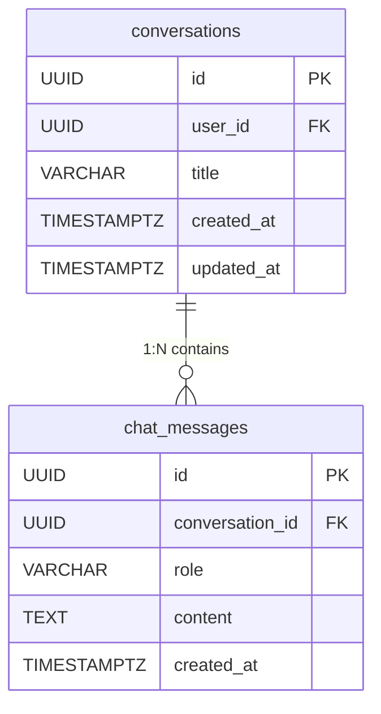
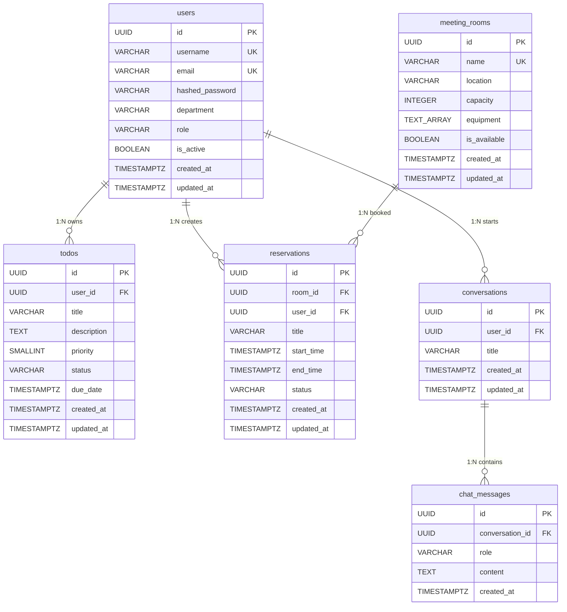
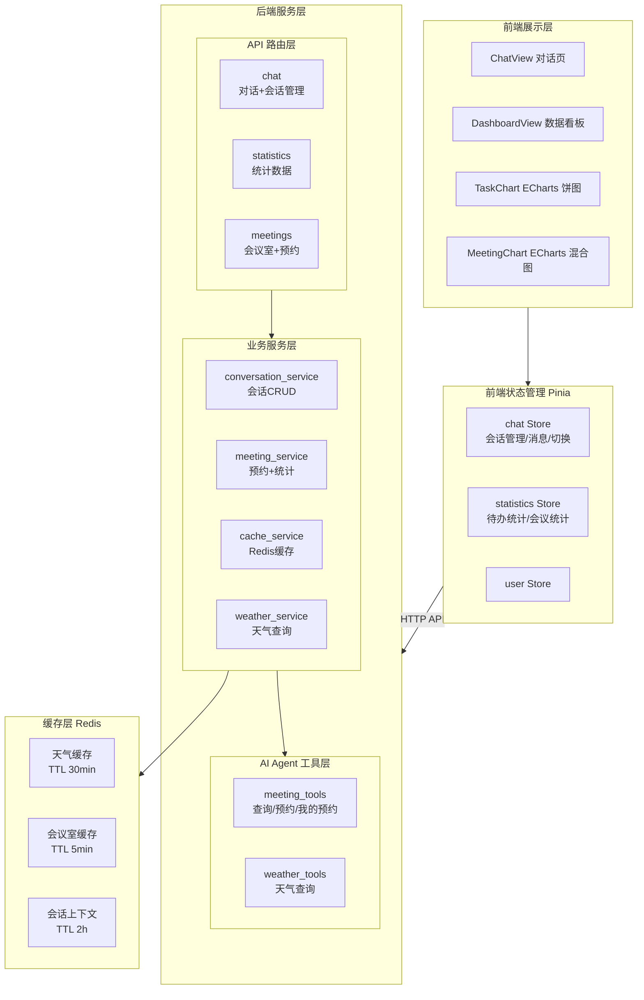
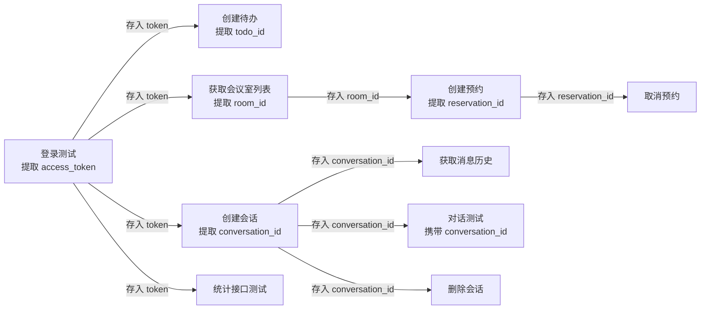

# AI 数字员工系统 — 第二迭代报告

---

## 1. 迭代概述

| 项目 | 内容 |
|------|------|
| **迭代周期** | 第二迭代 |
| **迭代目标** | 在第一迭代 MVP 基础上，完成数据可视化大屏落地、会议室自然语言预约全流程打通、多轮对话会话管理、Redis 缓存体系建设及天气查询集成，将系统从"能用"推进到"好用" |
| **与上一迭代关系** | 承接第一迭代 MVP 核心链路，深化会议室、对话、统计三大模块，新增数据看板和缓存层 |

### 1.1 迭代功能全景图

```mermaid
flowchart TB
    system[AI数字员工系统]

    system --> iter1[第一迭代已完成]
    system --> iter2[第二迭代新增]

    iter1 --> auth[用户认证与安全]
    iter1 --> chat_basic[基础对话与SSE流式]
    iter1 --> todo[待办事项管理]
    iter1 --> knowledge[知识库问答]

    iter2 --> dashboard[数据可视化大屏]
    iter2 --> meeting_full[会议室预约全流程]
    iter2 --> conversation[多轮对话会话管理]
    iter2 --> cache[Redis缓存体系]
    iter2 --> weather[天气查询集成]
    iter2 --> stats[统计数据系统]

    dashboard --> task_chart[任务状态饼图 ECharts]
    dashboard --> meeting_chart[会议室使用混合图 ECharts]
    dashboard --> stat_cards[统计卡片面板]
    dashboard --> detail_list[最近待办与会议室详情]

    meeting_full --> nl_room[自然语言查询会议室]
    meeting_full --> nl_reserve[自然语言创建预约]
    meeting_full --> nl_my[自然语言查看我的预约]
    meeting_full --> conflict[时间冲突自动检测]

    conversation --> conv_create[创建/切换会话]
    conversation --> conv_history[消息历史持久化]
    conversation --> conv_delete[会话删除]
    conversation --> conv_context[上下文窗口管理]

    cache --> weather_cache[天气缓存 30min]
    cache --> room_cache[会议室缓存 5min]
    cache --> session_cache[会话上下文缓存 2h]
    cache --> cache_fallback[Redis不可用降级]

    weather --> weather_query[实时天气查询]
    weather --> weather_city[中文城市智能识别]

    stats --> todo_stats[待办按状态/优先级统计]
    stats --> meeting_stats[会议室使用率统计]
    stats --> overview[综合数据概览]
```

**图1：第二迭代功能模块图（灰色为第一迭代已完成，蓝色为本迭代新增）**

---

## 2. 第二迭代需求分析 (Requirements)

### 2.1 迭代范围声明

> **第二迭代聚焦于"体验升级与功能深化"**：在第一迭代 MVP 基础上，实现数据可视化看板、会议室自然语言交互全流程、多轮对话会话管理、Redis 缓存架构和天气查询集成。RBAC 完整权限体系、消息推送通知、移动端深度适配等不在本迭代范围内。

---

### 2.2 功能需求详细描述

#### 2.2.1 数据可视化大屏（ECharts）

| 需求项 | 描述 |
|--------|------|
| **统计卡片面板** | Dashboard 页面顶部展示四张统计卡片：待办总数、已完成数（含完成率百分比）、进行中数、会议预约数（含总会议时长），数据实时从统计 API 获取 |
| **任务状态饼图** | 使用 ECharts 绘制环形饼图，按四种状态（待处理/进行中/已完成/已取消）展示任务分布，支持交互式 Tooltip 显示数值和百分比 |
| **会议室使用混合图** | 使用 ECharts 绘制柱线混合图：左 Y 轴柱状图展示各会议室预约次数（蓝色渐变），右 Y 轴折线图展示使用时长（绿色），X 轴为会议室名称 |
| **最近待办列表** | 展示用户最近的待办事项，带状态标签（颜色区分），点击可通过 AI 管理 |
| **会议室使用进度** | 以进度条形式展示各会议室预约次数，直观反映使用率 |
| **响应式布局** | 使用 Element Plus 的 `el-row` / `el-col` 栅格系统，支持不同屏幕尺寸（xs/sm/md/lg）自适应 |
| **手动刷新** | 提供刷新按钮，支持一键重新加载所有统计数据 |

#### 2.2.2 会议室自然语言预约全流程

| 需求项 | 描述 |
|--------|------|
| **自然语言查询会议室** | 用户通过对话查询会议室，如"有哪些会议室"、"能容纳10人的会议室"，Agent 调用 `list_meeting_rooms` 工具，支持按容量筛选，返回名称、位置、容量、设备等信息 |
| **自然语言创建预约** | 用户通过对话预约会议室，如"帮我预约明天上午10点到11点的A栋301会议室"，Agent 自动提取会议室 ID、时间段、会议主题，调用 `create_reservation` 工具完成预约 |
| **时间冲突检测** | 创建预约时系统自动检测同一会议室的时间冲突（基于 PostgreSQL EXCLUDE 约束），冲突时返回友好提示 |
| **查看我的预约** | 用户通过对话查看预约记录，如"我有哪些会议预约"，Agent 调用 `list_my_reservations` 工具，返回预约列表含状态、时间、时长、会议室信息 |
| **RESTful API 完善** | 提供完整的会议室 RESTful API：会议室列表/详情查询、预约创建（含冲突检测）/列表（分页+历史筛选）/详情/取消，所有接口均有认证和数据隔离 |

#### 2.2.3 多轮对话与会话管理

| 需求项 | 描述 |
|--------|------|
| **会话 CRUD** | 支持创建新会话、获取会话列表、删除会话，会话标题自动从首条消息截取前20个字符生成 |
| **消息历史持久化** | 用户和 AI 的每条消息均持久化存储到 `chat_messages` 表，支持按会话 ID 加载完整历史记录 |
| **会话切换** | 前端左侧侧边栏展示会话历史列表，支持点击切换会话、自动加载对应消息历史 |
| **上下文窗口** | 同一会话内自动维护最近50条消息上下文，传入 Agent 时排除当前消息，确保 Agent 理解上下文指代 |
| **会话归属验证** | 所有会话操作均验证 `user_id` 归属权限，确保用户只能访问自己的会话和消息 |
| **相对时间显示** | 会话列表中显示相对时间（刚刚、X分钟前、X小时前、X天前），提升可读性 |

#### 2.2.4 Redis 缓存体系

| 需求项 | 描述 |
|--------|------|
| **异步 Redis 连接** | 使用 `redis.asyncio` 建立异步连接池，支持连接超时（5s）、操作超时（5s）、健康检查间隔（30s）、最大连接数（20） |
| **天气数据缓存** | 缓存天气查询结果，TTL 30分钟，避免频繁调用第三方 API |
| **会议室列表缓存** | 缓存可用会议室列表（按容量分 key），TTL 5分钟，创建/取消预约后自动清除 |
| **会话上下文缓存** | 缓存用户会话上下文，TTL 2小时，加速 Agent 上下文加载 |
| **降级处理** | Redis 连接失败或操作异常时静默降级，不影响主业务流程，仅记录警告日志 |
| **生命周期管理** | 应用启动时初始化 Redis 连接，关闭时释放资源，提供连接可用性检查接口 |

#### 2.2.5 天气查询集成

| 需求项 | 描述 |
|--------|------|
| **实时天气查询** | 用户通过对话查询天气，如"北京今天天气怎么样"，Agent 调用 `get_weather` 工具返回温度、天气状况、湿度、风向、风力等完整信息 |
| **中文城市智能识别** | 支持中文城市名（如"北京"）和拼音（如"beijing"）输入，自动匹配城市编码 |
| **格式化输出** | 天气信息使用格式化展示，包含更新时间 |
| **缓存优化** | 同一城市30分钟内重复查询直接返回缓存数据，减少第三方 API 调用 |

### 2.3 统计数据系统

| 需求项 | 描述 |
|--------|------|
| **待办事项统计 API** | `GET /api/v1/statistics/todo-stats`：返回按状态分组的待办数量（pending/in_progress/completed/cancelled/total）及按优先级分组的未完成任务数 |
| **会议室使用统计 API** | `GET /api/v1/statistics/meeting-stats`：返回按会议室分组的预约次数和总使用时长，支持 `include_all_users` 参数（管理员可查看全量数据） |
| **数据概览 API** | `GET /api/v1/statistics/overview`：综合返回用户信息、待办统计和会议统计，一次请求获取仪表盘所需的全部数据 |
| **前端状态管理** | Pinia Store 管理统计数据，支持并行加载、计算衍生指标（完成率、活跃任务数、总预约次数、总会议时长） |

### 2.4 本迭代明确不包含的功能

- RBAC 完整权限体系（admin/manager/user 角色细分）
- WebSocket 消息推送与待办到期提醒
- 移动端深度适配与 PWA 支持
- 日历视图的会议室预约展示
- 多 Agent 并行调度与协作
- 复杂审批流与工作流引擎

---

## 3. 第二迭代系统设计 (System Design)

### 3.1 新增/变更接口表

#### 3.1.1 统计模块 API（新增）

| 方法 | 路径 | 功能 | 认证 | 说明 |
|------|------|------|------|------|
| GET | `/api/v1/statistics/todo-stats` | 待办事项统计 | 是 | 返回按状态和优先级分组的统计数据 |
| GET | `/api/v1/statistics/meeting-stats` | 会议室使用统计 | 是 | 支持 `include_all_users` 参数 |
| GET | `/api/v1/statistics/overview` | 数据概览 | 是 | 综合统计，一次请求获取全量 |

#### 3.1.2 会话管理 API（新增）

| 方法 | 路径 | 功能 | 认证 | 说明 |
|------|------|------|------|------|
| GET | `/api/v1/chat/conversations` | 获取会话列表 | 是 | 按更新时间倒序，最多50条 |
| POST | `/api/v1/chat/conversations` | 创建新会话 | 是 | 支持自定义标题 |
| GET | `/api/v1/chat/conversations/{id}/messages` | 获取会话消息历史 | 是 | 含归属权限验证 |
| DELETE | `/api/v1/chat/conversations/{id}` | 删除会话 | 是 | 级联删除所有消息 |

#### 3.1.3 会议室模块 API（完善）

| 方法 | 路径 | 功能 | 认证 | 变更说明 |
|------|------|------|------|----------|
| GET | `/api/v1/meetings/rooms` | 获取会议室列表 | 是 | 新增 `min_capacity` 筛选参数 |
| GET | `/api/v1/meetings/rooms/{id}` | 获取会议室详情 | 是 | 新增接口 |
| POST | `/api/v1/meetings/reservations` | 创建预约 | 是 | 完善冲突检测和错误反馈 |
| GET | `/api/v1/meetings/reservations` | 获取我的预约 | 是 | 新增 `include_past`、分页参数 |
| GET | `/api/v1/meetings/reservations/{id}` | 获取预约详情 | 是 | 新增接口 |
| DELETE | `/api/v1/meetings/reservations/{id}` | 取消预约 | 是 | 完善状态校验 |

---

### 3.2 数据模型变更

#### 3.2.1 新增表：conversations（会话表）

**conversations 表**：存储用户聊天会话，索引 `idx_conversations_user_id` 加速用户会话查询。

**chat_messages 表**：存储会话消息记录，包含消息角色（user/assistant/system）、内容和时间戳。索引 `idx_chat_messages_conversation_id` 和 `idx_chat_messages_created_at` 分别加速会话消息查询和时间排序。

#### 3.2.2 更新后的完整 E-R 图

---

### 3.3 架构调整：新增缓存层

**本迭代架构变更要点：**

1. **新增缓存层**：引入 Redis 缓存服务（`cache_service`），为天气查询、会议室列表、会话上下文提供多级 TTL 缓存
2. **新增会话服务**：`conversation_service` 提供完整的会话和消息 CRUD
3. **新增数据看板**：`DashboardView` + `TaskChart` + `MeetingChart` 构成数据可视化层
4. **Agent 工具扩展**：新增 `meeting_tools`（3个工具）和 `weather_tools`（1个工具）

### 3.4 前端组件新增

| 组件 | 文件 | 功能 | 依赖 |
|------|------|------|------|
| **DashboardView** | `views/DashboardView.vue` | 数据看板页面：统计卡片 + 图表 + 详情列表 | TaskChart, MeetingChart, statistics Store |
| **TaskChart** | `components/TaskChart.vue` | ECharts 环形饼图：任务状态分布 | echarts |
| **MeetingChart** | `components/MeetingChart.vue` | ECharts 柱线混合图：会议室使用统计 | echarts |
| **statistics Store** | `stores/statistics.js` | 统计数据状态管理：并行获取、衍生计算 | statistics API |
| **chat Store 增强** | `stores/chat.js` | 新增会话列表管理、切换、删除、消息历史加载 | chat API |

### 3.5 AI Agent 工具注册表

| 工具名称 | 模块 | 功能 | 参数 | 是否需要用户绑定 |
|----------|------|------|------|----------------|
| `list_meeting_rooms` | meeting_tools | 查询可用会议室 | min_capacity（可选） | 是 |
| `create_reservation` | meeting_tools | 创建会议室预约 | room_id, title, start_time, end_time | 是 |
| `list_my_reservations` | meeting_tools | 查看我的预约 | include_past（可选） | 是 |
| `get_weather` | weather_tools | 查询城市天气 | city | 否 |

---

## 4. 第二迭代系统测试 (Testing)

### 4.1 新增接口测试

**测试方式**：Postman 接口自动化测试（沿用第一迭代测试集合，新增分组）

#### 4.1.0 Postman 测试集合更新

> 测试集合名称：`AI数字员工系统-第二迭代测试`
> 基础地址：`http://localhost:8000`

| 分组 | 测试项数 | 说明 |
|------|----------|------|
| 3-会议室模块 | 6 | 会议室列表 + 容量筛选 + 创建预约 + 获取预约列表 + 获取预约详情 + 取消预约 |
| 4-AI对话模块 | 2 | 发送对话消息 + 同一会话多轮对话 |
| 5-统计模块 | 3 | 待办统计 + 会议统计 + 数据概览 |
| 6-会话管理 | 4 | 创建会话 + 获取列表 + 获取历史 + 删除会话 |

**变量链式传递机制（更新）**：

#### 4.1.1 统计接口测试

| 接口 | 测试用例 | 预期结果 | 断言脚本 |
|------|----------|----------|----------|
| GET `/api/v1/statistics/todo-stats` | 携带 Bearer Token 获取待办统计 | 200 OK，返回 pending/in_progress/completed/cancelled/total 字段 | 校验 status=200 + data.total 为数字 |
| GET `/api/v1/statistics/meeting-stats` | 携带 Bearer Token 获取会议室统计 | 200 OK，返回 rooms 数组，每项含 room_name/reservation_count/total_hours | 校验 status=200 + data.rooms 为数组 |
| GET `/api/v1/statistics/overview` | 携带 Bearer Token 获取数据概览 | 200 OK，返回 todo_stats + meeting_stats + user 信息 | 校验含 todo_stats 和 meeting_stats 字段 |

#### 4.1.2 会话管理接口测试

| 接口 | 测试用例 | 预期结果 | 断言脚本 |
|------|----------|----------|----------|
| POST `/api/v1/chat/conversations` | 创建新会话 `{"title": "测试会话"}` | 200 OK，返回 id + title + created_at | 校验 id 为字符串 + 自动存入 `conversation_id` |
| GET `/api/v1/chat/conversations` | 获取会话列表 | 200 OK，返回会话数组 | 校验返回值为数组 + 包含刚创建的会话 |
| GET `/api/v1/chat/conversations/{id}/messages` | 获取会话消息历史 | 200 OK，返回消息数组 | 校验返回值为数组 |
| DELETE `/api/v1/chat/conversations/{id}` | 删除会话 | 200 OK | 校验 success 为 true |

#### 4.1.3 会议室完整流程测试（增强）

| 接口 | 测试用例 | 预期结果 | 断言脚本 |
|------|----------|----------|----------|
| GET `/api/v1/meetings/rooms` | 查询可用会议室 | 200 OK，返回含设备信息的会议室列表 | 校验 items 为数组 + 自动存入 `room_id` |
| GET `/api/v1/meetings/rooms?min_capacity=8` | 按容量筛选会议室 | 200 OK，所有结果容量 ≥ 8 | 校验每项 capacity ≥ 8 |
| POST `/api/v1/meetings/reservations` | 创建预约（room_id + 时间段 + 主题） | 201 Created，返回预约详情 | 校验 status=201 + 自动存入 `reservation_id` |
| GET `/api/v1/meetings/reservations` | 获取我的预约列表 | 200 OK，返回含状态的预约列表 | 校验 items 为数组 + 包含刚创建的预约 |
| GET `/api/v1/meetings/reservations/{id}` | 获取预约详情 | 200 OK，返回完整预约信息 | 校验 id 与 reservation_id 一致 |
| DELETE `/api/v1/meetings/reservations/{id}` | 取消预约 | 204 No Content | 校验状态码 204 或 200 |

### 

---

### 4.3 回归测试

> 验证第一迭代已有功能在本次变更后仍然正常工作。

| 回归项 | 测试方式 | 预期结果 |
|--------|----------|----------|
| 用户登录 | Postman Runner 运行认证分组 | 全部通过 |
| 待办事项 CRUD | Postman Runner 运行待办分组 | 全部通过 |
| SSE 流式对话 | 前端发送消息 | 流式输出正常 |
| 知识库问答 | 前端输入公司政策问题 | FastGPT 正常返回 |

### 4.4 测试截图清单

| 序号 | 截图场景 | 用途 | 备注 |
|------|----------|------|------|
| 1 | Postman 第二迭代测试集合运行结果（Runner 全量通过） | 证明新增 API 接口全部通过 | 含分组名和通过数 |
| 2 | 数据看板完整页面 | 证明 ECharts 可视化正常 | **核心截图** |

---

## 5. 第二迭代项目管理 (Project Management)

### 5.1 任务分配表

| 角色 | 姓名 | 职责 | 具体工作内容 |
|------|------|------|-------------|
| 后端开发 |  | 全栈后端 | 统计数据 API（todo-stats/meeting-stats/overview）、会话管理服务（ConversationService CRUD）、Redis 缓存服务（cache_service 多级 TTL）、会议室预约 Agent 工具（meeting_tools 三个工具）、天气查询工具（weather_tools）、限流器增强（Redis + 内存双层限流） |
| 前端开发 |  | 前端工程 | DashboardView 数据看板页面、TaskChart ECharts 饼图组件、MeetingChart ECharts 混合图组件、statistics Store 状态管理、chat Store 会话管理增强（会话列表/切换/删除/历史加载）、侧边栏对话历史 UI、统计 API 和会议 API 前端封装 |
| 文档与测试 |  | 质量保障 | Postman 新增统计/会话管理/会议室完整流程测试分组、前端数据看板和会话管理测试、数据闭环验证（预约→数据库→看板三层闭环）、第二迭代报告撰写 |

### 5.2 已完成任务证明

#### 5.2.1 新增功能运行截图

| 截图场景 | 说明 | 截图要求 |
|----------|------|----------|
| 数据看板完整页面 | 统计卡片 + ECharts 图表 + 详情列表 | 含浏览器地址栏和完整页面 |
| ECharts 图表交互 | 鼠标悬停 Tooltip 展示 | 饼图和混合图各一张 |
| 天气查询对话 | AI 返回格式化天气信息 | 截图 |

### 5.3 遗留问题与风险

| 问题 | 影响 | 解决方案 | 优先级 |
|------|------|----------|--------|
| 流式输出为模拟流式（按标点分块） | 首 token 延迟较高 | 下一迭代接入 LLM 原生 streaming | P1 |
| 缓存一致性 | 预约后缓存可能短暂不一致 | 已实现创建/取消预约后自动清除缓存 | 已解决 |
| 会话历史上限50条 | 超长对话可能丢失早期上下文 | 下一迭代实现上下文摘要策略 | P2 |

### 5.4 下一迭代计划

| 优先级 | 功能模块 | 具体内容 | 预期目标 |
|--------|----------|----------|----------|
| P0 | **LLM 原生流式输出** | 接入 LLM token-level streaming，替代当前按句子分块的模拟流式 | 首 token 到达时间 < 1s，打字机效果更自然 |
| P0 | **多轮对话增强** | 优化 Agent 上下文窗口管理，支持长会话的上下文摘要与截断策略 | 支持 50+ 轮对话不丢失关键上下文 |
| P1 | **权限体系完善** | 实现 RBAC 完整模型（admin/manager/user），管理后台界面 | 不同角色看到不同数据和功能 |
| P1 | **消息通知** | 待办到期提醒、预约变更通知 | WebSocket 实时推送 |
| P2 | **移动端适配** | 响应式布局深度优化，支持手机浏览器访问 | 主要功能在移动端可用 |
| P2 | **日历视图** | 会议室预约日历展示 | 直观查看每日会议安排 |

---

## 附录

### A. 累计功能完成度

| 功能模块 | 第一迭代 | 第二迭代 | 状态 |
|----------|---------|---------|------|
| 用户认证与安全 | ✅ 已完成 | — | 完成 |
| 智能对话（基础） | ✅ SSE 流式 | — | 完成 |
| 待办事项管理 | ✅ 已完成 | — | 完成 |
| 知识库问答 | ✅ FastGPT 对接 | — | 完成 |
| 会议室预约 | 基础 API | ✅ 全流程对接 | 完成 |
| 数据可视化大屏 | 未开始 | ✅ ECharts 落地 | 完成 |
| 多轮对话管理 | 未开始 | ✅ 会话 CRUD | 完成 |
| Redis 缓存体系 | 未开始 | ✅ 多级 TTL 缓存 | 完成 |
| 天气查询集成 | 未开始 | ✅ 已集成 | 完成 |
| 统计数据系统 | 未开始 | ✅ 已完成 | 完成 |
| LLM 原生流式 | — | — | 第三迭代 |
| RBAC 权限体系 | — | — | 第三迭代 |
| 消息推送通知 | — | — | 第三迭代 |
| 移动端适配 | — | — | 第四迭代 |

### B. 技术栈汇总（更新）

| 层级 | 技术 | 本迭代变更 |
|------|------|-----------|
| 前端框架 | Vue 3 + Vite | — |
| 数据可视化 | **ECharts** | **新增** |
| 状态管理 | Pinia | 新增 statistics Store |
| UI 组件库 | Element Plus | — |
| HTTP 客户端 | Axios | — |
| 后端框架 | FastAPI | — |
| ORM | SQLAlchemy 2.0 (Async) | — |
| AI 框架 | Langchain | 新增 meeting_tools/weather_tools |
| 知识库 | FastGPT | — |
| 数据库 | PostgreSQL | 新增 conversations/chat_messages 表 |
| 缓存 | **Redis** | **新增缓存服务层** |
| 容器化 | Docker + Docker Compose | — |

### C. 数据库表一览（更新）

| 表名 | 记录数（测试） | 说明 | 本迭代变更 |
|------|---------------|------|-----------|
| users | 2 | 测试用户 test + 管理员 admin | — |
| todos | 4 | 用户待办事项 | — |
| meeting_rooms | 3 | A栋301/A栋302/B栋201 | — |
| reservations | 3 | 会议室预约记录 | 完善 EXCLUDE 约束 |
| conversations | 6 | 聊天会话 | **新增** |
| chat_messages | 50 | 聊天消息记录（user:25 / assistant:25） | **新增** |

### D. 测试账号

| 角色 | 用户名 | 密码 | 部门 |
|------|--------|------|------|
| 普通用户 | test | 123456 | 技术部 |
| 管理员 | admin | 123456 | 管理部 |
